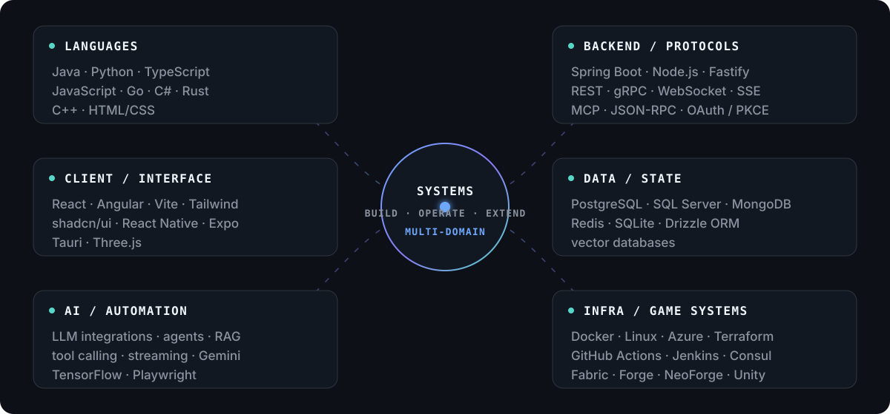

  

Software engineer building across backend systems, infrastructure, developer tooling, AI integrations, interfaces, and game technology.

I tend to work on software that has to survive contact with reality: distributed services, deployment automation, self-hosted infrastructure, agent/tool protocols, stateful applications, and long-lived mod ecosystems.

## Flagship public systems

| Project | Engineering surface |
| :--- | :--- |
| **[World Engine](https://github.com/UpperMoon0/World-Engine)** | World-scale physics and simulation optimization for large moving structures. Adaptive spatial indexing, Java/native batching, persistent native registries, local Rapier regions, bounded parallel stepping, incremental voxel geometry, terrain streaming, and network LOD across Fabric and NeoForge. |
| **[Inventors](https://github.com/UpperMoon0/Inventors)** | Progression-driven engineering modpack and integration platform. Coordinates custom mods, staged mechanical progression, KubeJS material/recipe unification, FTB Quests, CI validation, reproducible client/server packaging, and release automation. |
| **[NsTut Economy](https://github.com/UpperMoon0/Economy)** | Multi-version, multi-loader market system for Minecraft. Order books, physical item/fluid settlement, automated matching, portfolio state, storage networks, extensible market APIs, and a custom terminal UI. |
| **[Discord Adapter](https://github.com/UpperMoon0/Discord-Adapter)** | Discord-to-Lily bridge and guild-scoped MCP administration surface. OAuth 2.0 + PKCE, Redis-backed policy, media inspection, semantic tool exposure, runtime access control, and agent-facing operational tooling. |

## System map

  

<strong>Technology matrix</strong>

 

| Domain | Technologies |
| :--- | :--- |
| `LANGUAGES` |           |
| `BACKEND / PROTOCOLS` |           |
| `FRONTEND / CLIENT` |          |
| `DATA / STATE` |        |
| `AI / AUTOMATION` |         |
| `INFRASTRUCTURE` |          |
| `GAME / MODDING` |             |

## Current vector

Building systems where AI, infrastructure, and software tooling converge: agents with real operational reach, resilient self-hosted services, distributed control surfaces, and reusable platforms rather than isolated demos.

`design → build → deploy → observe → repair → evolve`

## Contact

[Email](mailto:vonguyenminhnhatanphu@gmail.com)
